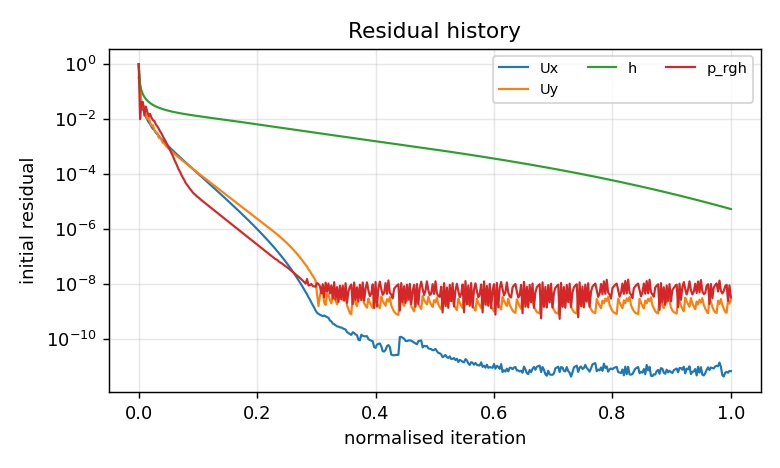
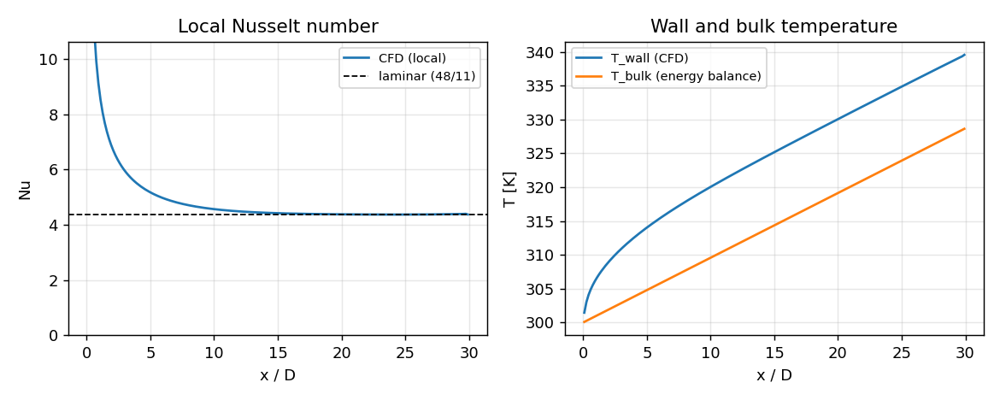
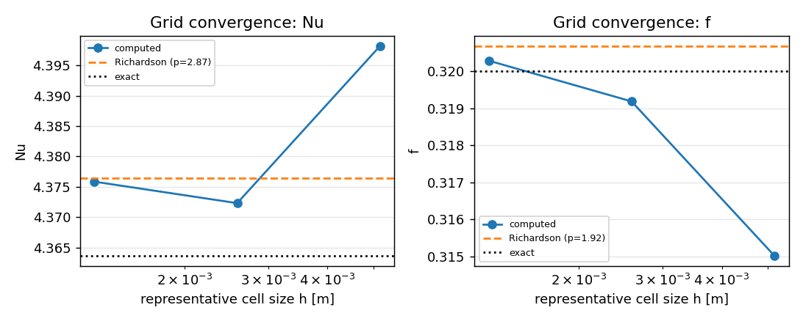

# NuAgent report — `pipe-laminar-Re200`

**Status:** SUCCESS  &nbsp;|&nbsp; **Backend:** openfoam &nbsp;|&nbsp; **Case:** heated_pipe &nbsp;|&nbsp; **Generated:** 2026-09-02T05:19:13+0000

> Fully developed laminar flow in a uniformly heated pipe, unit-Prandtl liquid, Re = 200. Verifies the CFD backend against the exact fully developed Nusselt number and friction factor and performs a three-level grid-convergence study.


## 1. Problem definition

| Parameter | Value |
|---|---|
| Fluid | unit_prandtl_liquid (ρ=1000.0 kg/m³, μ=0.001 Pa·s, Pr=1) |
| Diameter / length | 0.02 m / 0.6 m (L/D = 30.0) |
| Reynolds number | 200 (laminar); U_in = 0.01 m/s |
| Wall heat flux | 1e+04 W/m²; T_in = 300.0 K |
| Turbulence model | laminar, wall treatment: resolved, Pr_t = 0.85 |
| Base mesh | 20 radial × 6.0 cells/D, target y+ = 1.0 |
| Numerics | linearUpwind, relax U/p/h = 0.7/0.3/0.7, target residual 1e-05 |
| Execution | local, 1 proc(s), max 3 attempt(s) |


## 2. Run summary

| Item | Value |
|---|---|
| Attempts | 1 |
| Final numerics adjustments | `none` |
| Convergence | all tracked residuals below 1e-05 at iteration 831 (worst h=5.38e-06; ignored: Uz) |
| Iterations / steps | 831 |
| Final residuals | Ux=6.9e-12, Uy=2.9e-09, Uz=2.6e-05, h=5.4e-06, p_rgh=3.3e-09 |
| Wall time | 10.1 s (local) |




## 3. Quantities of interest

| QoI | Value |
|---|---|
| Nu | 4.3758 |
| Nu_std_developed | 0.0054046 |
| f | 0.32029 |
| f_dp | 0.32029 |
| f_tau | 0.32159 |
| Re | 200 |
| Pr | 1 |
| T_wall_outlet | 339.57 |
| dp_per_length | 0.80072 |
| n_cells | 3600 |


**Consistency checks**

| Check | Value |
|---|---|
| tau_wall_developed | 0.0040199 |
| friction_factor_consistency | -0.0040614 |
| yplus_avg_estimate | 0.24806 |
| mass_balance_error | -0.0012688 |
| outlet_bulk_temperature | 328.69 |
| energy_balance_error | -6.8131e-04 |

- wall shear stress from near-wall velocity gradient (first-order estimate)
- friction factor 'f' taken from dp/dx; f_tau uses near-wall velocity gradient (first-order estimate)





## 4. Solution verification


**Discretisation error against exact solutions (finest grid)**

| QoI | Exact | Computed | Error |
|---|---|---|---|
| Nu | 4.3636 | 4.3758 | +0.28 % |
| f | 0.32 | 0.32029 | +0.09 % |


**Grid-refinement study** (refinement ratio 2.0, 3 levels)

| Level | h [m] | cells | Nu | f | 
|---|---|---|---|---|
| r=1 | 1.291e-03 | 3600 | 4.3758 | 0.32029 | 
| r=0.5 | 2.582e-03 | 900 | 4.3723 | 0.31919 | 
| r=0.25 | 5.164e-03 | 225 | 4.3982 | 0.31501 | 


**GCI (Celik et al. 2008 / ASME V&V 20)**

| QoI | observed order p | Richardson extrapolate | GCI (fine, 95 %) | convergence | asymptotic |
|---|---|---|---|---|---|
| Nu | 2.87 | 4.3764 | 0.02 % | oscillatory | yes |
| f | 1.9214 | 0.32068 | 0.15 % | monotonic | yes |

- Nu: fine-grid error vs exact: 0.280 %; oscillatory convergence: GCI reported but should be interpreted with caution
- f: fine-grid error vs exact: 0.090 %





## 5. Validation

| QoI | Computed | Reference | Source | Deviation | Tolerance | Ref. band | Result |
|---|---|---|---|---|---|---|---|
| Nu | 4.3758 | 4.3636 | laminar (48/11) | +0.3 % | ±2 % | exact | PASS |
| f | 0.32029 | 0.32 | laminar (64/Re) | +0.1 % | ±2 % | exact | PASS |


**Overall validation:** PASSED
- Nu: numerical-uncertainty band does not overlap the reference band.
- f: numerical-uncertainty band overlaps the reference band.


## 6. Review

**Verdict:** accept_with_warnings — 1 warning(s) from rule-based review
- ⚠ grid convergence for Nu is oscillatory


## Decision log

| # | Node | Message |
|---|---|---|
| 1 | plan | using the provided specification |
| 2 | build | built openfoam case (attempt 1, 3600 cells) |
| 3 | run | local run finished rc=0 in 10.1s |
| 4 | monitor | converged: all tracked residuals below 1e-05 at iteration 831 (worst h=5.38e-06; ignored: Uz) |
| 5 | postprocess | extracted QoIs |
| 6 | verify | level r=0.5: 900 cells, rc=0 |
| 7 | verify | level r=0.25: 225 cells, rc=0 |
| 8 | verify | grid convergence index computed |
| 9 | validate | Nu: +0.3% vs laminar (48/11) (pass), f: +0.1% vs laminar (64/Re) (pass) |
| 10 | critique | accept_with_warnings: 1 warning(s) from rule-based review |


## Provenance

```json
{
  "timestamp": "2026-09-02T05:19:13+0000",
  "nuagent_version": "0.1.0",
  "git": {
    "commit": null,
    "dirty": true
  },
  "python": "3.11.15",
  "platform": "Linux-6.18.44-fc-v22-x86_64-with-glibc2.39",
  "hostname": "vm",
  "packages": {
    "langgraph": "1.2.11",
    "langchain-core": "1.6.1",
    "numpy": "2.4.4",
    "scipy": "1.17.1",
    "emcee": "3.1.6",
    "SALib": "1.5.2",
    "pydantic": "2.13.3"
  },
  "solvers": {
    "openfoam": null,
    "festim": null,
    "mpirun": "/usr/bin/mpirun"
  },
  "llm_model": null,
  "spec_sha256": "6df92d8888fb8d69",
  "attempts": 1,
  "adjustments": {},
  "n_decisions": 10
}
```

_Report generated by NuAgent 0.1.0. Every number above is traceable to files under `runs/pipe-laminar-Re200`._