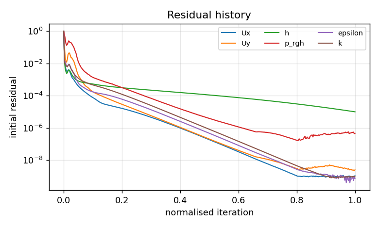
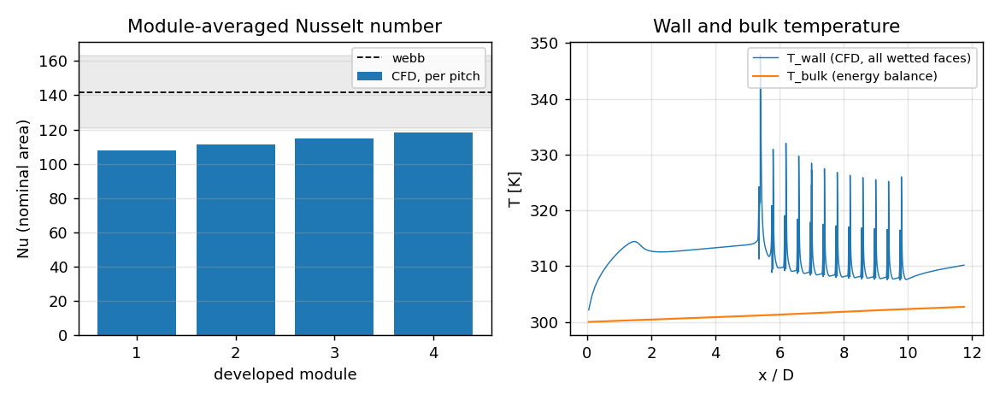
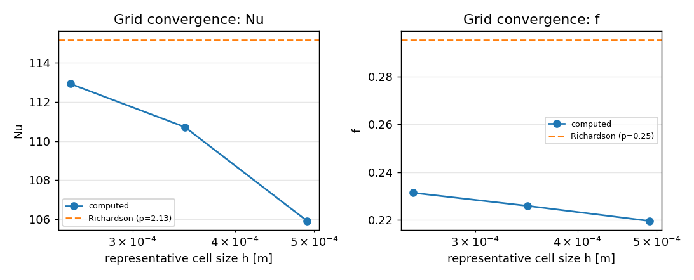

# NuAgent report — `ribbed-tube-air-Re20k`

**Status:** SUCCESS  &nbsp;|&nbsp; **Backend:** openfoam &nbsp;|&nbsp; **Case:** ribbed_tube &nbsp;|&nbsp; **Generated:** 2026-09-02T07:10:24+0000

> Rib-roughened cooling tube (turbulators): air at 300 K, Re = 20 000, square ribs e/D = 0.04 at p/e = 10, 1 kW/m2 wall heat flux. Module-averaged Nusselt number and friction factor over the periodic fully developed pitches are validated against Webb et al. (1971); enhancement over the smooth tube is reported.


## 1. Problem definition

| Parameter | Value |
|---|---|
| Fluid | air_300K (ρ=1.16 kg/m³, μ=1.85e-05 Pa·s, Pr=0.708) |
| Diameter / length | 0.02 m / 0.236 m (smooth entry 5.0 D, 12 ribs, exit 2.0 D) |
| Ribs | e/D = 0.04, p/e = 10.0, w/e = 1.0 (e = 0.8 mm, p = 8 mm); 4 modules averaged |
| Reynolds number | 2e+04 (turbulent); U_in = 15.95 m/s |
| Wall heat flux | 1000 W/m²; T_in = 300.0 K |
| Turbulence model | LaunderSharmaKE, wall treatment: resolved, Pr_t = 0.85 |
| Base mesh | 36 radial × 10.0 cells/D, target y+ = 1.0 |
| Base mesh | 36 core + 16 rib-layer radial cells, 10.0 axial cells per rib height, target y+ = 1.0 |
| Execution | local, 1 proc(s), max 3 attempt(s) |


## 2. Run summary

| Item | Value |
|---|---|
| Attempts | 1 |
| Final numerics adjustments | `none` |
| Convergence | solver residualControl satisfied after 5630 iterations |
| Iterations / steps | 5630 |
| Final residuals | Ux=9.1e-10, Uy=2.5e-09, Uz=4.4e-07, h=1.0e-05, p_rgh=5.4e-07, epsilon=7.6e-10, k=9.3e-10 |
| Wall time | 0.0 s (cached) |




## 3. Quantities of interest

| QoI | Value |
|---|---|
| Nu | 112.93 |
| Nu_base | 123.34 |
| f | 0.23131 |
| Nu_over_Nu0 | 2.1841 |
| f_over_f0 | 8.8451 |
| thermal_performance | 1.0561 |
| dp_per_pitch | 13.649 |
| Re | 20000 |
| Pr | 0.70835 |
| e_plus | 136.03 |
| n_cells | 37080 |


**Consistency checks**

| Check | Value |
|---|---|
| module_nu_spread | 0.034443 |
| wetted_to_nominal_area_ratio | 1.1834 |
| mass_balance_error | -0.0012687 |
| outlet_bulk_temperature | 302.64 |
| energy_balance_error | -0.03152 |
| Nu_tube_wall_developed | 112.54 |
| area_fraction_tube_wall | 0.76025 |
| Nu_rib_top_developed | 123.39 |
| area_fraction_rib_top | 0.077715 |
| Nu_rib_side_developed | 74.376 |
| area_fraction_rib_side | 0.16203 |
| reattachment_x_over_e | 3.2727 |
| reversed_flow_fraction_of_gap | 0.37459 |
| yplus_avg_estimate | 0.30686 |

- Nu: nominal area pi*D*p with the area-weighted temperature of all wetted faces; Nu_base: same heat input but the tube-wall (base) temperature, as wall-thermocouple experiments measure
- averaged modules 8-11 of 12; last module excluded (exit effects)





## 4. Solution verification


**Grid-refinement study** (refinement ratio 1.4, 3 levels)

| Level | h [m] | cells | Nu | f | 
|---|---|---|---|---|
| r=1 | 2.519e-04 | 37080 | 112.93 | 0.23131 | 
| r=0.714 | 3.476e-04 | 19474 | 110.72 | 0.22585 | 
| r=0.51 | 4.902e-04 | 9790 | 105.92 | 0.21951 | 


**GCI (Celik et al. 2008 / ASME V&V 20)**

| QoI | observed order p | Richardson extrapolate | GCI (fine, 95 %) | convergence | asymptotic |
|---|---|---|---|---|---|
| Nu | 2.1253 | 115.18 | 2.49 % | monotonic | yes |
| f | 0.25391 | 0.29538 | 34.62 % | monotonic | yes |





## 5. Validation

| QoI | Computed | Reference | Source | Deviation | Tolerance | Ref. band | Result |
|---|---|---|---|---|---|---|---|
| Nu | 112.93 | 141.89 | webb | -20.4 % | ±25 % | ±15 % | PASS |
| f | 0.23131 | 0.23918 | webb | -3.3 % | ±15 % | ±10 % | PASS |


**Overall validation:** PASSED
- Nu: numerical-uncertainty band does not overlap the reference band.
- f: numerical-uncertainty band overlaps the reference band.


## 6. Review

**Verdict:** accept_with_warnings — 2 warning(s) from rule-based review
- ⚠ energy balance error -3.2 % exceeds 2 %
- ⚠ numerical uncertainty (GCI) for f is 34.6 % > 5 %


## Decision log

| # | Node | Message |
|---|---|---|
| 1 | plan | using the provided specification |
| 2 | build | reusing existing case with identical specification (attempt 1) |
| 3 | run | existing results reused; solver not re-run |
| 4 | monitor | converged: solver residualControl satisfied after 5630 iterations |
| 5 | postprocess | extracted QoIs |
| 6 | verify | level r=0.714: 19474 cells, rc=0 |
| 7 | verify | level r=0.51: 9790 cells, rc=0 |
| 8 | verify | grid convergence index computed |
| 9 | validate | Nu: -20.4% vs webb (pass), f: -3.3% vs webb (pass) |
| 10 | critique | accept_with_warnings: 2 warning(s) from rule-based review |


## Provenance

```json
{
  "timestamp": "2026-09-02T07:10:24+0000",
  "nuagent_version": "0.1.0",
  "git": {
    "commit": "df8fd7f236e62948bb6262129dc10f615842941f",
    "dirty": true
  },
  "python": "3.11.15",
  "platform": "Linux-6.18.44-fc-v22-x86_64-with-glibc2.39",
  "hostname": "vm",
  "packages": {
    "langgraph": "1.2.11",
    "langchain-core": "1.6.1",
    "numpy": "2.4.4",
    "scipy": "1.17.1",
    "emcee": "3.1.6",
    "SALib": "1.5.2",
    "pydantic": "2.13.3"
  },
  "solvers": {
    "openfoam": null,
    "festim": null,
    "mpirun": "/usr/bin/mpirun"
  },
  "llm_model": null,
  "spec_sha256": "776fb8e96b188116",
  "attempts": 1,
  "adjustments": {},
  "n_decisions": 10
}
```

_Report generated by NuAgent 0.1.0. Every number above is traceable to files under `runs/ribbed-tube-air-Re20k`._