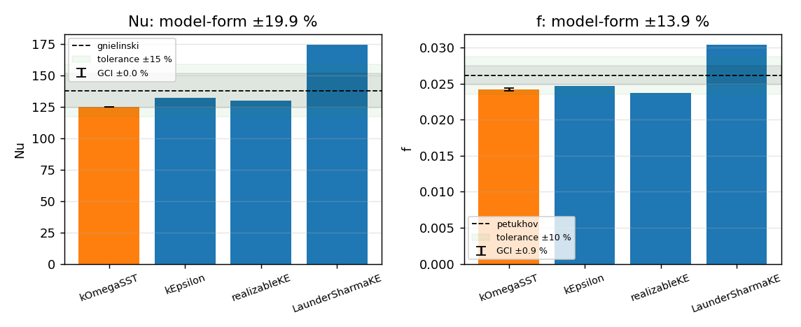

# NuAgent report — `pipe-turbulent-Re20k`

**Status:** SUCCESS  &nbsp;|&nbsp; **Backend:** openfoam &nbsp;|&nbsp; **Case:** heated_pipe &nbsp;|&nbsp; **Generated:** 2026-09-02T19:38:36+0000

> Turbulent forced convection of water in a 20 mm pipe at Re = 20 000 with 50 kW/m2 uniform wall heat flux. Validates the fully developed Nusselt number against Gnielinski (+-10 %) and the friction factor against Petukhov.


## 1. Problem definition

| Parameter | Value |
|---|---|
| Fluid | water_300K (ρ=996.0 kg/m³, μ=0.00085 Pa·s, Pr=5.82) |
| Diameter / length | 0.02 m / 0.8 m (L/D = 40.0) |
| Reynolds number | 2e+04 (turbulent); U_in = 0.8534 m/s |
| Wall heat flux | 5e+04 W/m²; T_in = 300.0 K |
| Turbulence model | kOmegaSST, wall treatment: resolved, Pr_t = 0.85 |
| Base mesh | 40 radial × 10.0 cells/D, target y+ = 1.0 |
| Numerics | linearUpwind, relax U/p/h = 0.7/0.3/0.7, target residual 1e-05 |
| Execution | local, 1 proc(s), max 3 attempt(s) |


## 2. Pre-flight review

No findings: references valid for the operating point, wall treatment and domain length consistent.


## 3. Run summary

| Item | Value |
|---|---|
| Attempts | 1 |
| Final numerics adjustments | `none` |
| Convergence | all tracked residuals below 1e-05 at iteration 819 (worst h=4.69e-06; ignored: Uz) |
| Iterations / steps | 819 |
| Final residuals | Ux=1.2e-09, Uy=1.6e-08, Uz=2.2e-05, h=4.7e-06, p_rgh=6.6e-09, omega=7.5e-10, k=1.9e-09 |
| Wall time | 0.0 s (cached) |


## 4. Quantities of interest

| QoI | Value |
|---|---|
| Nu | 124.59 |
| Nu_std_developed | 0.34354 |
| f | 0.024163 |
| f_dp | 0.024163 |
| f_tau | 0.02463 |
| Re | 20000 |
| Pr | 5.8246 |
| T_wall_outlet | 315.34 |
| dp_per_length | 438.19 |
| n_cells | 16000 |


**Consistency checks**

| Check | Value |
|---|---|
| tau_wall_developed | 2.2334 |
| friction_factor_consistency | -0.018999 |
| yplus_avg_estimate | 0.96796 |
| mass_balance_error | -0.0012688 |
| outlet_bulk_temperature | 302.25 |
| energy_balance_error | -0.0014549 |

- wall shear stress from near-wall velocity gradient (first-order estimate, mu + rho*nut_wall)
- friction factor 'f' taken from dp/dx; f_tau uses near-wall velocity gradient (first-order estimate, mu + rho*nut_wall)


## 5. Solution verification


**Grid-refinement study** (refinement ratio 2.0, 3 levels)

| Level | h [m] | cells | Nu | f | 
|---|---|---|---|---|
| r=1 | 7.071e-04 | 16000 | 124.59 | 0.024163 | 
| r=0.5 | 1.414e-03 | 4000 | 124.95 | 0.02354 | 
| r=0.25 | 2.828e-03 | 1000 | 153.91 | 0.026428 | 


**GCI (Celik et al. 2008 / ASME V&V 20)**

| QoI | observed order p | Richardson extrapolate | GCI (fine, 95 %) | convergence | asymptotic |
|---|---|---|---|---|---|
| Nu | 6.3295 | 124.59 | 0.00 % | monotonic | yes |
| f | 2.2131 | 0.024334 | 0.89 % | oscillatory | yes |

- Nu: observed order p=6.33 exceeds the formal order; GCI may be optimistic
- f: oscillatory convergence: GCI reported but should be interpreted with caution


## 6. Model-form uncertainty (turbulence-closure ensemble)

Same case, numerics and core grid family, 4 closures (primary: **kOmegaSST**); 4 converged. Wall treatment and near-wall resolution follow each closure's formulation.

| Closure (wall treatment, cells) | Nu | vs primary | vs gnielinski | f | vs primary | vs petukhov | y⁺ | converged |
|---|---|---|---|---|---|---|---|---|
| **kOmegaSST (resolved, 16000 cells)** | 124.59 | +0.0 % | -9.6 % | 0.024163 | +0.0 % | -7.6 % | 1.0 | yes |
| kEpsilon (wall function, 2800 cells) | 132.28 | +6.2 % | -4.0 % | 0.024674 | +2.1 % | -5.7 % | 38.1 | yes |
| realizableKE (wall function, 2800 cells) | 130.01 | +4.3 % | -5.7 % | 0.023655 | -2.1 % | -9.5 % | 37.5 | yes |
| LaunderSharmaKE (resolved, 16000 cells) | 174.16 | +39.8 % | +26.3 % | 0.030368 | +25.7 % | +16.1 % | 1.1 | yes |


| QoI | closure range | model-form uncertainty (½ range) | numerical uncertainty (GCI) | dominant |
|---|---|---|---|---|
| Nu | 124.59 – 174.16 | ±19.9 % | 0.00 % | model_form |
| f | 0.023655 – 0.030368 | ±13.9 % | 0.89 % | model_form |





## 7. Validation

| QoI | Computed | Reference | Source | Deviation | Tolerance | Ref. band | Result |
|---|---|---|---|---|---|---|---|
| Nu | 124.59 | 137.84 | gnielinski | -9.6 % | ±15 % | ±10 % | PASS |
| Nu [dittus_boelter] | 124.59 | 128.43 | dittus_boelter | -3.0 % | ±25 % | ±25 % | PASS |
| f | 0.024163 | 0.026151 | petukhov | -7.6 % | ±10 % | ±5 % | PASS |


**Overall validation:** PASSED
- Nu: numerical-uncertainty band overlaps the reference band.
- Nu [dittus_boelter]: numerical-uncertainty band overlaps the reference band.
- f: numerical-uncertainty band does not overlap the reference band.


## 8. Review

**Verdict:** accept_with_warnings — 3 warning(s) from rule-based review
- ⚠ grid convergence for f is oscillatory
- ⚠ turbulence closures disagree on Nu by 40 % of the kOmegaSST value (model-form uncertainty ±20 % vs numerical GCI 0.0 %)
- ⚠ turbulence closures disagree on f by 28 % of the kOmegaSST value (model-form uncertainty ±14 % vs numerical GCI 0.9 %)


## Decision log

| # | Node | Message |
|---|---|---|
| 1 | plan | using the provided specification |
| 2 | review | no findings |
| 3 | build | reusing existing case with identical specification (attempt 1) |
| 4 | run | existing results reused; solver not re-run |
| 5 | monitor | converged: all tracked residuals below 1e-05 at iteration 819 (worst h=4.69e-06; ignored: Uz) |
| 6 | postprocess | extracted QoIs |
| 7 | verify | level r=0.5: 4000 cells, rc=0 |
| 8 | verify | level r=0.25: 1000 cells, rc=0 |
| 9 | verify | grid convergence index computed |
| 10 | model_form | 4/4 closures converged; model-form uncertainty Nu ±19.9 %, f ±13.9 % |
| 11 | validate | Nu: -9.6% vs gnielinski (pass), Nu [dittus_boelter]: -3.0% vs dittus_boelter (pass), f: -7.6% vs petukhov (pass) |
| 12 | critique | accept_with_warnings: 3 warning(s) from rule-based review |


## Provenance

```json
{
  "timestamp": "2026-09-02T19:38:36+0000",
  "nuagent_version": "0.1.0",
  "git": {
    "commit": "a5c5642c5587bc07fa335bca950896e030aafcf3",
    "dirty": true
  },
  "python": "3.11.15",
  "platform": "Linux-6.18.44-fc-v22-x86_64-with-glibc2.39",
  "hostname": "vm",
  "packages": {
    "langgraph": "1.2.11",
    "langchain-core": "1.6.1",
    "numpy": "2.4.4",
    "scipy": "1.17.1",
    "emcee": "3.1.6",
    "SALib": "1.5.2",
    "pydantic": "2.13.3"
  },
  "solvers": {
    "openfoam": null,
    "festim": null,
    "mpirun": "/usr/bin/mpirun"
  },
  "llm_model": null,
  "spec_sha256": "16638ec51f0e4ec0",
  "attempts": 1,
  "adjustments": {},
  "n_decisions": 12
}
```

_Report generated by NuAgent 0.1.0. Every number above is traceable to files under `runs/pipe-turbulent-Re20k`._